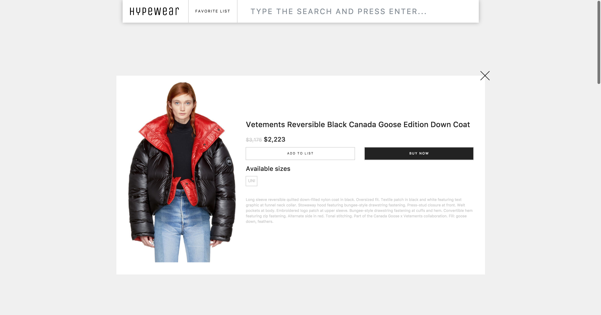

# Hypewear
Hypewear is a search engine for fashion. 
You can filter and save your favorite products in your list and you can buy the products that you like.
Thousand products, of thousand brands from the cheapest one to the most expensive comes from the shopcollective API

### Homepage

### Product detail

### Favorite list

## Installation
* Clone the repo and cd into it.
* Run `cd hypewear/client`
* Run `yarn install`.
* Run `yarn start`

## Tech Stack
* [React](https://reactjs.org/)
* [Redux](https://redux.js.org/)
* [SASS](http://sass-lang.com/)
* [BEM](http://getbem.com/)
* [React-Bootstrap](https://react-bootstrap.github.io/)
